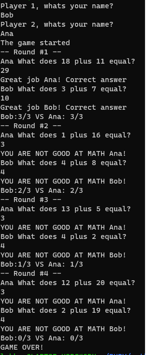

# Math Game built in Ruby

## A 2-Player math game played from a command line.
- Players enter names from CL.
- The first player is picked randomly.
- Players take turns to answer simple math addition problems. A new math question is generated for each turn by picking two numbers between 1 and 20. 
- Each player has 3 lives. 
- Player looses a life if they answered incorrectly.
- When one player loses all 3 lives the game is over and winner is announced

## Installation

The Math Game is written in Ruby, so you will need the Ruby interpreter to execute the Ruby code and run the game. If you already have Ruby installed, you can simply run the game from the command line by executing the main.rb file with the ruby command.

```bash
ruby main.rb
```

 ```md
    
    ```